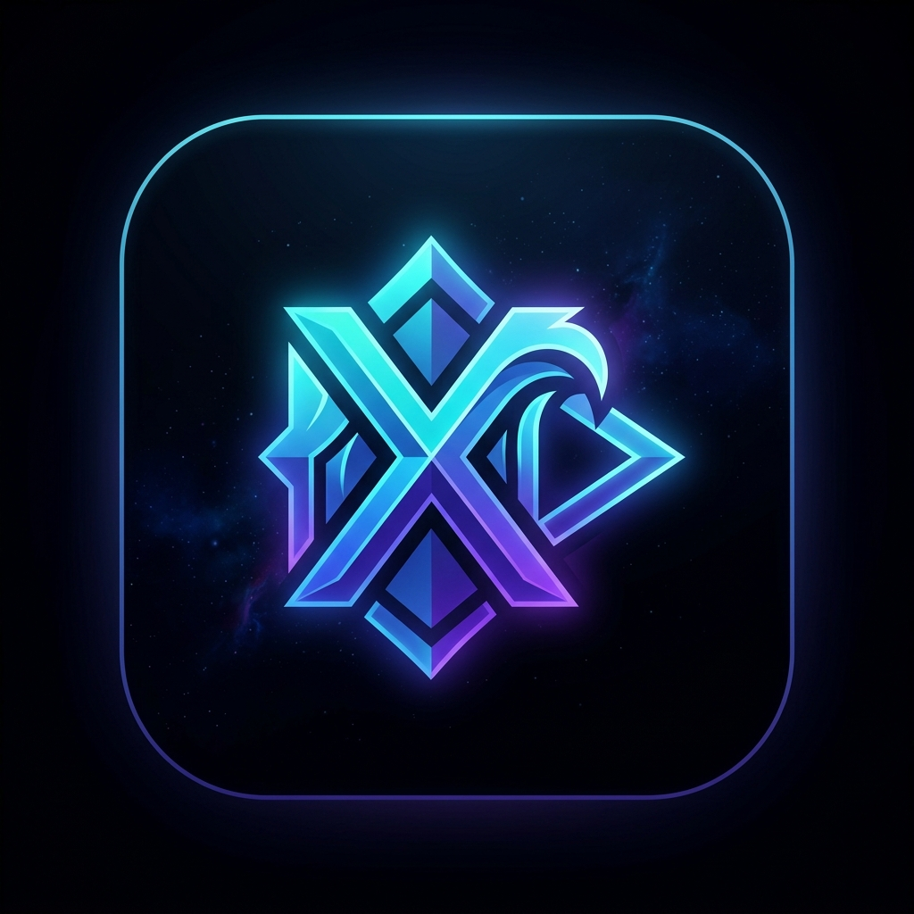

<div align="center">



# AniWaveX

**Next-Gen Ad-Free High-Performance Anime Streaming Platform & Native Android Client**

[](https://aniwavex.bond)
[](releases/AniWaveX.apk)
[](https://workers.cloudflare.com)
[](https://nextjs.org/)
[](https://capacitorjs.com/)

---

[**🌐 Open Web App (aniwavex.bond)**](https://aniwavex.bond) • [**📥 Download Android APK**](releases/AniWaveX.apk) • [**⚙️ Architecture**](#-architecture) • [**🚀 Getting Started**](#-getting-started)

</div>

---

## ✨ Features

- ⚡ **High-Speed Dual-Worker Proxy Pool**: Dynamically balances video streaming requests across multiple Cloudflare Edge Workers with automatic HTTP 429 / quota failover, supporting **200,000+ daily streaming requests**.
- 📱 **Native Android Experience**:
  - **Lightweight & Fast**: Compact APK (~5 MB) using hardware-accelerated modern Android WebKit.
  - **Hardware Back Button**: Seamlessly navigates episode history, closes modals, and cleanly exits.
  - **Auto Screen Orientation**: Portrait mode for browsing anime details; automatically rotates to full landscape upon entering fullscreen video playback.
  - **AMOLED Immersive Theme**: Dark `#0a0a0c` status bar and navigation bar integration.
  - **Instant OTA Updates**: UI improvements and new web features sync directly to the app without requiring constant manual APK reinstalls.
- 🎬 **Premium Streaming Engine**: Sub/Dub selector, multiple video quality resolutions, auto-next episode, auto-skip intro/outro, and keyboard shortcuts.
- 🔄 **Tracker Sync**: Integration with AniList and MyAnimeList for progress tracking.

---

## 📱 Android App Download

The compiled Android APK is directly available in this repository:

👉 **[Download AniWaveX.apk (v1.0.0)](releases/AniWaveX.apk)**

### Installation on Android:
1. Download `AniWaveX.apk` onto your Android device.
2. Tap the file in your notification or Downloads folder.
3. Allow **Install from Unknown Sources** if prompted.
4. Open **AniWaveX** and enjoy seamless anime streaming!

---

## 🏗️ Architecture

```
AniWaveX/
├── mobile/                      # Native Android & Capacitor mobile project
│   ├── android/                 # Native Android Studio / Gradle project
│   │   ├── app/src/main/res/    # Custom mipmap launcher icons & splash screens
│   │   └── gradlew.bat          # Gradle build tool
│   ├── src/
│   │   ├── components/
│   │   │   └── MobileAppShell.tsx # Hardware back, orientation, status bar bridge
│   │   └── lib/
│   │       └── proxy-pool.ts    # Multi-worker proxy load balancer (200k req/day)
│   └── capacitor.config.ts      # Capacitor native configuration
├── releases/                    # Built production APKs
│   └── AniWaveX.apk             # Android debug/release APK (~5 MB)
├── public/                      # Static assets & brand logos
├── src/                         # Next.js web application core
└── Anivexa-API/                 # Streaming APIs & Cloudflare Worker proxy definitions
```

---

## 🚀 Getting Started

### 1. Web Application

To run the Next.js web app locally:

```bash
# Install dependencies
npm install

# Start development server
npm run dev
```

Visit `http://localhost:3000` in your browser.

### 2. Android Mobile Application

The mobile codebase resides in the isolated `mobile/` directory:

```bash
cd mobile

# Install mobile dependencies
npm install

# Build web assets and sync to native Android
npm run cap:build

# Open in Android Studio
npm run cap:android

# Or build APK directly via Gradle
cd android
.\gradlew.bat assembleDebug
```

The compiled APK will be output to:
`mobile/android/app/build/outputs/apk/debug/app-debug.apk`

---

## 🌐 Cloudflare Streaming Proxy Pool

The streaming backend utilizes a multi-worker pool to bypass CORS and distribute high-volume video segment traffic:

| Worker Endpoint | Region | Daily Capacity |
| :--- | :--- | :--- |
| `https://anidb-proxy.deek34137.workers.dev` | Global Edge | 100,000 reqs/day |
| `https://anidb-proxy.rajverma159310.workers.dev` | Global Edge | 100,000 reqs/day |
| **Combined Pool Total** | | **200,000+ reqs/day** |

Failover logic in `mobile/src/lib/proxy-pool.ts` automatically detects rate limits (HTTP 429) or network latency spikes and shifts traffic seamlessly to the next available worker in the pool.

---

## 📄 License

This project is licensed under the MIT License - see the LICENSE file for details.
